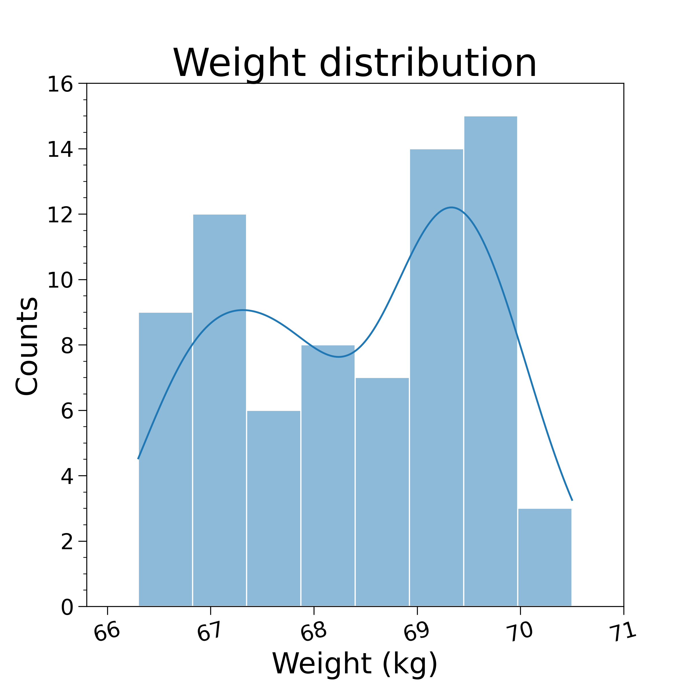

# FlexWorkout Project

## Goal

The main goal of this project is to study weight trend and distribution in order to improve workout performance and
muscle mass gain.

## Data (in progress..)

### Warning

Fake, simulated data is being used for now, as it takes a few months to be able to work with enough real data. 

Planning to start working with real data (about myself) by the end of February 2021. 

### Data Format

| Date     |   Weight (kg) |   Daily Difference (kg) | Training    |
|:--------:|:-------------:|:------------------:| :----------:|
2020-11-30 |     67.3      |    0.4             |  yes        |
2020-12-01 |     67.2      |   -0.1             |  no         |
2020-12-02 |     67.5      |    0.3             |  yes        |
2020-12-03 |     67.8      |    0.3             |  no         |
2020-12-04 |     67.3      |   -0.5             |  yes        |
2020-12-05 |     67.2      |   -0.1             |  yes        |
2020-12-06 |     66.8      |   -0.4             |  yes        |
2020-12-07 |     67.1      |    0.3             |  no         |

Note that "Daily Difference (kg)" is automatically computed: one just have to say whether he trained or not, and write
his current weight daily.

## Features (in progress..)

### Weight Trend

Updating every morning the current weight it is quite simple to draw a trendline following the oscillations of weight
during time. It is good habit to mark down training days and rest days for a better understending of weight
oscillations.

Example:

### Weight Distribution

A simple histogram about all weights. The use of it is to understand if the distribution is unimodal, bimodal... One
could have a couple of weight values in which he falls more frequently: this could be easily related to under-stress periods
or diet phases. 

Example:

### Daily Weight Difference Trend

Pretty similar to the weight trendline. However, this feature put emphasis on the daily weight oscillations by computing
the difference of weight between one day and the previous one. A positive difference means a weight gain, a negative
difference means a weight loss. Showing training days and rest days gives a better understanding of these oscillations:
one could discover a strong correlation between weight gain/loss and training days, if workout is done correctly.

Example:

### Daily Weight Difference Distribution

For an even better understanding of correlation between weight gain/loss and training days, this feature shows the
distribution of daily weight oscillations divided by training days and rest days. This way, it is easier to see if
training days lead to weight gain/loss or do not make sensible difference.

Example:

